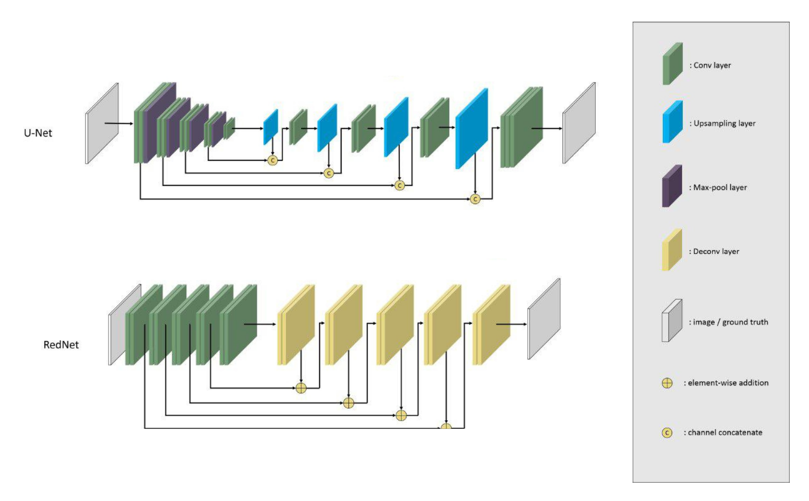
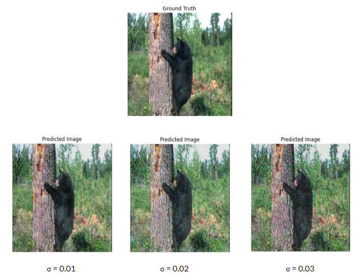
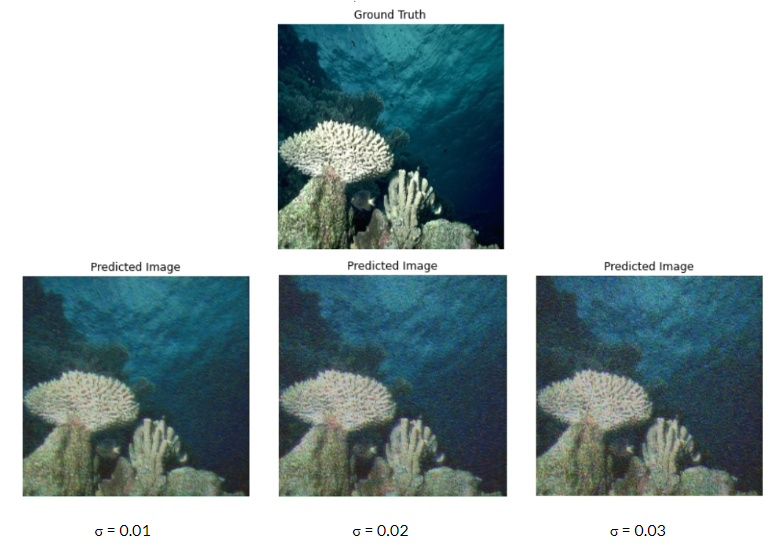
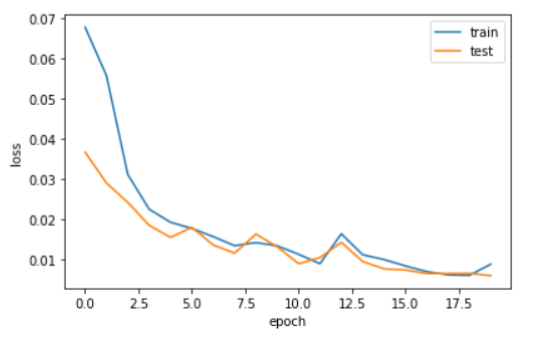
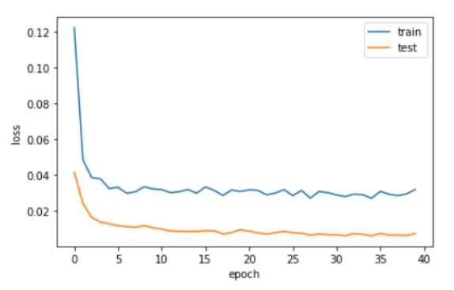

# National Institute of Technology Karnataka Surathkal

  
  <h2>

## EC386: Mini Project in Image Processing

## **Image Restoration without Denoised Priors**

## **MEMBERS**

- Inbasekaran Perumal : inba2002.p\@gmail.com
- Pranav Koundinya : pranavmkoundinya\@gmail.com

## **Guide**

- Prof. Sumam David S

## **_Course Instructor_**

- Prof. Deepu Vijayasenan

# Abstract

_In this project, we attempt to develop a neural network model which can restore noisy images. Unlike the conventional approach, the model is trained on noisy images, instead of clean images as ground truth. The images have been trained on Gaussian noise, with zero mean and a nonzero variance._

# Introduction

In traditional machine learning approach, image restoration is performed by creating a training dataset with noisy images $x_i$ as inputs to a neural network $f$ and their corresponding clean images $y_i$ as ground truth, which is to be compared with the output of the network. The training is an iterative process which attempts to minimize the loss function with respect to the weights $\theta$ of the neural network.
$$\underset{\theta}{argmin}\;\mathcal{L}\{f_\theta(x_i), y_i\}$$

This approach, thus, requires the possession of a clean dataset as a prerequisite. However, in many scenarios, this luxury is not affordable. Examples include MRI images and satellite images, where we have only the noisy images, but not their denoised/clean counterparts. This shortcoming can be overcome if we have knowledge about the distribution of the noise in the images. In this new approach, we train the neural networks with only noisy image pairs instead of clean-noisy pairs.

$$
    \underset{\theta}{argmin}\;\mathcal{L}\{f_\theta(x_i), \hat{y_i}\}
$$

This approach is based on the assumption that the average of all the noisy images in the training set is the clean/denoised image.

$$
    E\{\hat{y_i}|x_i\} = y_i
$$

Gaussian noise with zero mean, is one among the many types of noise which satisfies the above condition. The neural network is trained with Gaussian noised images. In a sense, the network learns to restore images without actually knowing what denoising is, or what the clean image looks like.

  
  <h2>

# Motivation

Image restoration has played and will continue to play, an important role in research, commercial photography, medical imaging, surveillance and remote sensing. In the field of medical imaging, and remote sensing, the images obtained will be predominantly noisy, and must be restored before any further processing. When we try to train neural networks to perform this, availability of ample training data becomes a bottleneck. Unfortunately this may not be possible in many cases. This project aims to lift the requirements on this availability, thus enabling us to train deep neural networks to restore noisy images for which there are no sources to learn from.

# Literature review

The main literary source for the project is the paper titled “Noise2Noise: Learning Image Restoration without Clean Data”, published by researchers from NVIDIA, Aalto University, and MIT CSAIL. On a first reading, it was understood that the paper focussed on restoring images using deep learning, but it achieved this without providing any denoised images to compare at all. The data used was obtained from various sources, including ImageNet, Kodak, BSD300, SET14. In summary, the paper aimed to show that computers can learn to turn bad images into good images by only looking at bad images

# Implementation

## Network Architecture

Two networks have been used to implement the algorithm: UNet(Ronneberger et. al, 2015) and REDNet(Mao et.al, 2016). UNet has series of convolution and deconvolution layers, with skip connections to aid gradient propagation. The UNet that we have used has 7 convolution(encoder) layers and 11 deconvolution(decoder) layers. REDNet, on the other hand, has a series of convolution and deconvolution layers with padding, so that the height and width of the images remains same. The skip connections, which were concatenation units are replaced by addition units. The RED we have used has 5 convolution(encoder) and 5 deconvolution(decoder) layers.

## Gaussian Noise

The images have all been corrupted with Gaussian noise before feeding them to the neural network. Gaussian noise refers to the random noise obeying the Gaussian distribution

$$
    p(z) = \frac{1}{\sigma\sqrt{2\pi}}e^{-\frac{(z - \mu)^2}{2\sigma^2}}
$$

Gaussian noise can be generated in Python using the numpy.random.randn() function, which takes in the output shape, mean and standard deviation as the parameters. Throughout the training process, the mean has been chosen to be zero, wheras the model was trained for three values of standard deviation-0.01, 0.02, and 0.03. The chosen values satisfy eq.(3).

## Preprocessing and Training

The dataset used for training the networks is BSD500(Berkeley Segmentation Dataset) which consists of 300 images for training, 100 images for validation and 100 images for testing. The images are normalized and noised before feeding them to the neural network for training. The training was performed for 40 epochs using the Adam(Kingma et. al, 2015) optimizer. The loss function used was mean squared error.

## Performance Metrics

Two performance metrics have been used for evaluating the performance of the model:

### Peak Signal to Noise Ratio(PSNR)

It is the ratio between the maximum possible power of an image and the power of corrupting noise that affects the quality of its representation. To estimate the PSNR of an image, it is necessary to compare that image to an ideal clean image with the maximum possible power. The PSNR of a noisy image $\hat{I}$ and its clean counterpart $I$ is mathematically defined as

$$
    PSNR(\hat{I}, I) = 10 log_{10}\frac{MAX_{I}^2}{MSE(\hat{I}, I)}
$$

where MSE denotes the mean squared error.

### Structural Similarity Index Measure(SSIM)

The Structural Similarity Index (SSIM) is a perceptual metric that quantifies image quality degradation caused by processing such as data compression or by losses in data transmission. The SSIM of two images $x$ and $y$ of common size N x N is

$$
    SSIM(x, y) = \frac{(2\mu_{x}\mu_{y} + c_1)(2\sigma_{xy} + c_2)}{(\mu_{x}^2 + \mu_{y}^2 + c_1)(\sigma_{x}^2 + \sigma_{y}^2 + c_2)}
$$

where $\mu$ donotes mean, $\sigma$ denotes standard deviation. $c1 = (k_1 L)^2$ and $c2 = (k_2 L)^2$, k1 and k2 are by default taken to be 0.01 and 0.03. L refers to the dynamic range of the pixel values.

# Results

  
    <h4>UNet predictions</h4>

  
    <h4>RedNet predictions</h4>

The above figure compares the output of UNet and REDNet architectures. While the REDNet tries to remove noise by smoothing(the network has learnt Gaussian denoising), the UNet tries to retain the crispness and clarity in the image, although it is slightly granular. The PSNR of the output image in the case of REDNet has a mean PSNR of 30.30dB while the UNet has a mean PSNR of 26.53dB. The evolution of loss function during training is shown in the below figure.

  
    <h4>U-Net Mean Squared Loss Function</h4>

 
    <h4>Red-Net Mean Squared Loss Function</h4>

Next, we look at each model and its ability to restore the image for various values of the noise in the input image. RedNet predictions visualization the outputs of the REDNet model for inputs with standard deviation of noise, $\sigma$ = 0.01, 0.02 and 0.03(The neural networks are trained for the respective values of noise, before testing).
Similarly, UNet predictions visualization shows the outputs of the UNet model for inputs with standard deviation of noise, $\sigma$ = 0.01, 0.02 and 0.03. The mean PSNR and SSIM values of the two models, REDNet and UNet have been tabulated in table 1 and 2 respectively.

As is expected, the ability of a network to denoise an image reduces as the noise value it is trained to remove, increases. Similar trend is observed in the case of both REDNet and UNet architectures. However, the rate at which the image quality drops is more higher in the case of UNet than REDNet: in the case of UNet, the SSIM drops from 0.645 to 0.3746 as $\sigma$ increases from 0.01 to 0.03, whereas in the case of REDNet, it only drops from 0.577 to 0.435.

| **$(\sigma)_{UNet}$** | **Mean SSIM** | **Mean PSNR(in dB)** |
| --------------------- | ------------- | -------------------- |
| 0.01                  | 0.64533997    | 30.13082857986193    |
| 0.02                  | 0.46611664    | 32.33277383797268    |
| 0.03                  | 0.37464416    | 33.119557193755526   |

**Table 1: Performance of UNet**

| **$(\sigma)_{REDNet}$** | **Mean SSIM** | **Mean PSNR(in dB)** |
| ----------------------- | ------------- | -------------------- |
| 0.01                    | 0.5770542     | 30.955274337690753   |
| 0.02                    | 0.48596337    | 31.431179280986903   |
| 0.03                    | 0.43532306    | 32.044127396845184   |

**Table 2: Performance of REDNet**

# Conclusion

The conventional approach is to feed the neural network with a large amount of data and with noisy inputs and clear outputs, in the presence of which the neural network will be able to learn the concept of noise and when presented with a new previously unseen noisy image, it will be able to clear it up. This requires clean images for training purposes but the new approach does not need clean HQ images to be fed into the neural network. Normally we would say this is impossible and end this project. However, under suitable constraints like knowing the distribution of noise opens up the possibility of restoring noisy signals without seeing the clean one. It has also been shown that this technique can do close to as nearly as good as the classical denoising neural networks. It can potentially be used in healthcare to restore scanned MRI images or in satellite imagery where having access to clean images is nearly impossible due to technological limitations. Once the training process is completed it takes milliseconds to render the new image. But there is also a dark side to this, It can be used to remove text noise which presents a significant problem for copyright infringement.

# References

[1] : Jaakko Lehtinen, Jacob Munkberg, Jon Hasselgren, Samuli Laine, Tero Karras, Miika Aittala,and Timo Aila, _Noise2Noise: Learning Image Restoration without Clean Data_ in Proceedings of the 35th International Conference on Machine Learning, 2018.

[2] : Xiao-Jiao Mao, Chunhua Shen, Yu-Bin Yang, _Image Restoration Using Convolutional Auto-encoders with Symmetric Skip Connections_ in NIPS, 2016.

[3] : Olaf Ronneberger, Philipp Fischer, Thomas Brox, _U-Net: Convolutional Networks for Biomedical Image Segmentation_ in MICCAI 2015.

[4] : https://github.com/SunnerLi/Simple-Hourglass

[5] : https://www.youtube.com/watch?v=P0fMwA3X5KI&t=6s

[6] : https://www.youtube.com/watch?v=dcV0OfxjrPQ

[7] : https://www.analyticsvidhya.com/blog/2018/07/nvidias-noise2noise-technique-helps-you-fix-bad-images-in-milliseconds/

[8] : https://www2.eecs.berkeley.edu/Research/Projects/CS/vision/bsds/

[9] : https://en.wikipedia.org/wiki/Structural\_similarity

[10] : https://www.geeksforgeeks.org/python-peak-signal-to-noise-ratio-psnr/
